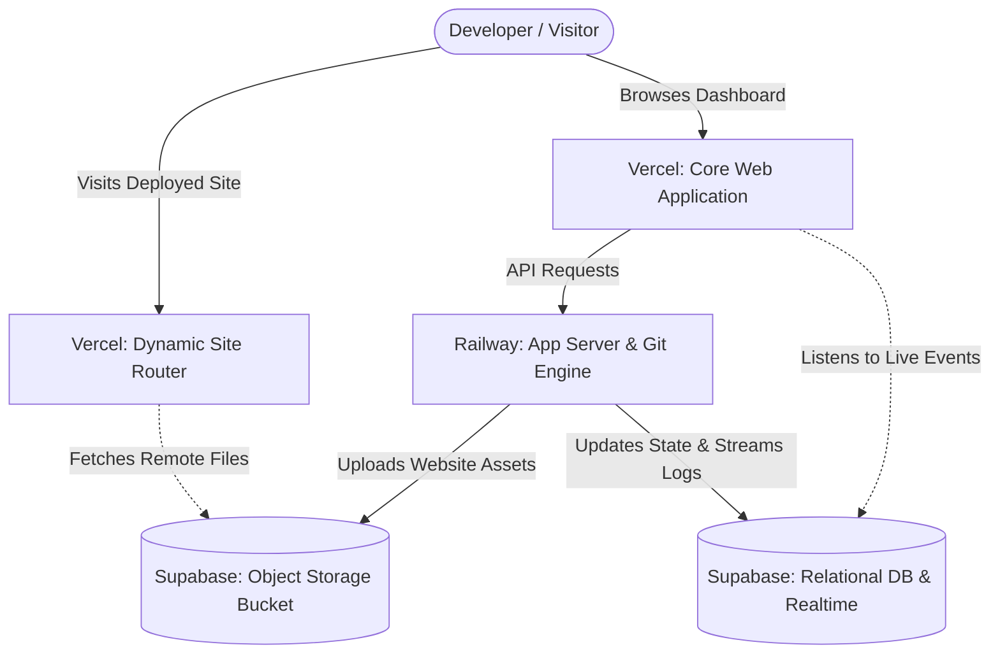
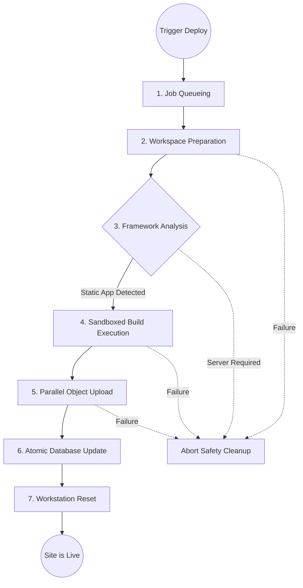

# Gitanic

Welcome to Gitanic, a distributed cloud-native Git hosting platform and static website deployment system. This project was developed as part of the coursework for 23XT66 - Cloud Computing Lab at PSG College of Technology.

Gitanic helps developers to easily create Git repositories, push source code, and deploy static websites automatically through one unified interface. We also offer a desktop client that provides a graphical interface similar to GitHub Desktop. For convenience, the package of the entire desktop application is provided as a single portable executable file.

---

## System Architecture

Gitanic operates as a three-service distributed system. By using cloud providers, the platform separates responsibilities to maintain smooth and scalable performance. The backend uses the design of a modular monolith: it runs as a single process for simplicity but keeps the internal modules for authentication, repositories, and deployment pipelines cleanly separated.

Furthermore, instead of relying on traditional reverse proxies for Git operations, we built a custom routing approach. This securely streams data natively through the application environment.



We distribute the workload across the following infrastructure:

| Cloud Service      | Primary Responsibility                                                                                                                                                                                                                                           |
| ------------------ | ---------------------------------------------------------------------------------------------------------------------------------------------------------------------------------------------------------------------------------------------------------------- |
| **Vercel**   | Hosts the primary web interface. It handles rendering and serves custom websites by dynamically fetching data on request without relying on complex wildcard domain setups.                                                                                      |
| **Railway**  | Hosts the main application server securely within a minimal container environment. This is where background job queues run, deployments execute, and raw repository data is held.                                                                                |
| **Supabase** | Manages the core data of the system through a relational database. It maintains data access rules so users can only access data they own. It also handles object storage for the files of the hosted site and handles a realtime connection for live build logs. |

---

## Design Patterns

To ensure long-term maintainability, the core logic of the application is built using standard design patterns:

| Pattern Utilized                | Application Purpose      | Conceptual Function                                                                                                                                                                                    |
| ------------------------------- | ------------------------ | ------------------------------------------------------------------------------------------------------------------------------------------------------------------------------------------------------ |
| **Model View Controller** | Overall Web Architecture | Web pages serve as the view layer, backend routers act as controllers, and dedicated internal services handle the business logic securely.                                                             |
| **Repository Pattern**    | Database Interactions    | Data logic is entirely separated from the business logic. Server services request data abstractly while specialized database layers process the required queries securely.                             |
| **Strategy Pattern**      | Build Automation Engine  | The system dynamically inspects incoming code. Based on the framework detected, it smoothly selects and applies the build steps required without hardcoding.                                           |
| **Observer Pattern**      | Log Streaming Lifecycle  | During a deployment, the system broadcasts internal events whenever a stage starts or finishes. The realtime platform observes these events and forwards them instantly to the client interface.       |
| **Singleton Pattern**     | Resource Management      | Prevents memory leaks by ensuring that heavy connections - such as database tunnels and client application state - are clearly instantiated only once across the life cycle of the entire application. |

---

## Deployment Pipeline

When a developer updates code or triggers a rebuild manually, the platform safely runs an execution workflow behind the scenes.



1. **Job Queueing:** The deployment request is pushed into a sequential line. This prevents the server from crashing by running only one active task at a time.
2. **Workspace Preparation:** The server generates an isolated, temporary workstation folder. All previous dependencies are wiped out to ensure a fresh build context.
3. **Framework Analysis:** The system completely scans the configuration files of the project to determine the necessary build sequence. If the application requires a persistent backend server, the deployment is blocked to protect the infrastructure.
4. **Sandboxed Build Execution:** Instead of giving the build complete server access, the deployment runs inside a restricted environment. We give it zero access to system secrets, limited downloading paths, and strict time limits.
5. **Parallel Object Upload:** After the site is packaged, the thousands of resulting files are chunked together and uploaded simultaneously to the storage servers to maximize the speed of transfer.
6. **Atomic Database Update:** A database-level trigger executes. This creates a guarantee that the live routing link of a website instantly swaps over to the newly constructed site, but strictly only if the whole process was completely successful.
7. **Workstation Reset:** The server scrubs the temporary data and cleans out remnants of the build container to free up server storage space.

---

## Supported Frameworks

The build system of the platform identifies projects and sets up build rules automatically. We support the following types of frameworks:

<div align="center">

| Project Type         | Framework Instances                    | Support Status     |
|---------------------|----------------------------------------|--------------------|
| Progressive Web Apps | React, Vue, Svelte, Bundled JavaScript | Fully Supported    |
| Single Page Apps     | Create React App, Standard SPAs        | Fully Supported    |
| Static Websites      | Plain HTML, CSS, JavaScript files      | Fully Supported    |
| Server Side Apps     | Next.js, Nuxt, Django, Express routing | Blocked |

</div>

We block server frameworks intentionally to ensure the infrastructure of the platform stays dedicated to static deployments without taking heavy processing loads.

---

## Deployment Routing

Whenever a visitor navigates to a public project link, they see a clean, readable pathway based on the username of the owner and the native project name of the repository. They will not see a randomized system number.

To achieve this, the web application intercepts the request dynamically. It evaluates the project name, safely queries the backend to determine what the newest active state of the site is, and funnels the remote files straight from the server storage bucket to the end user. To guarantee that integrated resources - like custom images or stylesheets - reconnect correctly behind the scenes, we automatically inject mapping metadata natively into the text structure right before the webpage finishes loading on the browser!

---

## Technology Stack

<div align="center">

| Category        | Stack Used                       |
|-----------------|----------------------------------|
| Frontend        | Next.js + Tailwind CSS           |
| Backend         | Node.js + Express.js             |
| Database        | PostgreSQL                       |
| Version Control | Git - CLI + Smart HTTP           |
| Deployment      | Linux - child_process + npm      |
| CI/CD           | Git Push Trigger                 |
| Desktop Application | JavaFX                       |
| Authentication  | JWT + Basic Auth + bcrypt        |

</div>

---

## Deployment Infrastructure

<div align="center">

| Layer     | Provider   |
|-----------|------------|
| Frontend  | Vercel     |
| Backend   | Railway    |
| Database  | Supabase   |
| Object Storage | Supabase |
| Routing   | Vercel Wildcard Domain |
| Logging   | Supabase Realtime |

</div>

---

## Getting Started

Follow these steps to safely setup the systems on your local development machine.

### System Prerequisites

Ensure you have Node.js installed on your platform. You will also need standard Java software development tools. Access to free-tier cloud platforms and an active PostgreSQL connection string are required to store information properly.

### 1. Database Initialization

Use an active database manager interface or the cloud platform to run the primary schema script. This action creates the relational foundations for repositories and deployment logs immediately.

### 2. Application Server

Navigate into the directory of the server implementation. Build an environment configuration matching the target database identifiers provided by the manager of the database.

```bash
cd backend
npm install
npm run dev        # Begins the backend application process with active hot-reloading
```

### 3. Web Interface

Access the primary frontend folder. Mirror the connection strings of your environment accordingly to route local application traffic precisely to the newly started development server.

```bash
cd frontend
npm install
npm run dev        # Starts the presentation interface on your standard development port
```

### 4. Client Desktop Compilation

To build a standalone executable application for operating straight from the machine, navigate into the desktop application workspace and trigger the comprehensive installer sequence.

```bash
cd javafx
mvn clean install    # Compiles and packs the executable source material together
mvn javafx:run       # Evaluates environment variables and initializes the graphical dashboard natively
```
