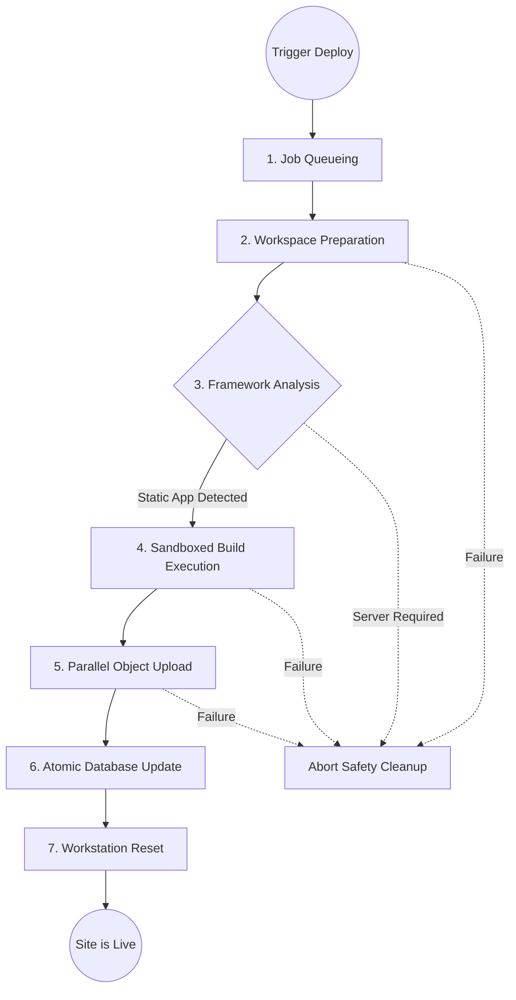

# Gitanic

## Overview

Gitanic is a distributed cloud-native Git hosting platform combined with a static website deployment system that allows developers to create repositories, push source code, and deploy static websites automatically through a unified interface. The platform also includes a desktop client that provides a graphical interface similar to GitHub Desktop, and the entire application is packaged as a single portable executable for easy distribution and usage.

---

## System Architecture

Gitanic is designed as a three-service distributed system that separates responsibilities across multiple cloud providers to ensure scalability and stable performance under load. The backend follows a modular monolith architecture, where the application runs as a single process while maintaining clear internal separation between modules such as authentication, repository management, and deployment pipelines to improve maintainability.


| Cloud Service      | Primary Responsibility                                                                                                                                                                                                                       |
| :----------------- | :------------------------------------------------------------------------------------------------------------------------------------------------------------------------------------------------------------------------------------------- |
| **Vercel**   | Hosts the frontend interface, while handling dynamic request resolution at runtime to serve deployed websites without relying on complex wildcard domain configuration.                                                                      |
| **Railway**  | Runs the core backend server inside a lightweight container environment, where it manages background job queues, executes deployment workflows, and stores repository data, allowing controlled and isolated execution of backend processes. |
| **Supabase** | Manages the database, enforces access rules for user-level isolation, handles object storage for production assets, and streams deployment logs in real time for monitoring.                                                                 |

---

## Design Patterns Used

| Pattern                         | Application              | Conceptual Functionality                                                                                                                                                                     |
| :------------------------------ | :----------------------- | :------------------------------------------------------------------------------------------------------------------------------------------------------------------------------------------- |
| **Model View Controller** | Overall Web Architecture | Separates the frontend, backend routing, and core services into view, controller, and model layers to maintain clear separation of concerns and keep the system easier to extend and manage. |
| **Repository**            | Database Interaction     | Abstracts database operations through dedicated layers so that application logic does not directly depend on queries, making changes safer and reducing coupling.                            |
| **Strategy**              | Build Automation Engine  | Selects the appropriate build strategy by analyzing repository structure, allowing the deployment pipeline to be extended easily later on.                                                   |
| **Observer**              | Log Streaming Lifecycle  | Tracks deployment stages and streams logs to the frontend in real time, allowing users to monitor progress continuously without waiting for the deployment to complete.                      |
| **Singleton**             | Resource Management      | Maintains single instances of shared resources such as database connections and application state to avoid duplication and control resource usage.                                           |

---

## Deployment Pipeline

When a developer pushes code or manually triggers a deployment, the platform executes a structured workflow:



- **Job Queueing**: Places deployment requests in a sequential queue so that only one build runs at a time, which prevents resource contention and avoids overloading the server.
- **Workspace Preparation**: Creates a fresh and isolated workspace for each deployment, ensuring that every build starts in a clean and reproducible environment.
- **Framework Analysis**: Scans project configuration files to determine the required build strategy, and to prevent deployment of repositories containing unsupported frameworks earlier.
- **Sandboxed Execution**: Executes the build inside a sandboxed environment with restricted permission, controlled resource access, and enforced time constraint to ensure safe execution.
- **Parallel Object Upload**: Splits generated files into chunks and uploads them concurrently, improving throughput and reducing overall deployment time.
- **Atomic Database Update**: Updates the routing layer only after the deployment completes successfully, ensuring users are served a consistent and stable version.
- **Workspace Reset**: Resets the build environment after deployment, to free resources and maintain system hygiene.

---

## Supported Frameworks

The build system of the platform identifies projects and sets up build rules automatically. We support the following types of frameworks:

<div align="center">

| Project Type         | Framework Instances                    | Support Status  |
| -------------------- | -------------------------------------- | --------------- |
| Progressive Web Apps | React, Vue, Svelte, Bundled JavaScript | Fully Supported |
| Single Page Apps     | Create React App, Standard SPAs        | Fully Supported |
| Static Websites      | Plain HTML, CSS, JavaScript files      | Fully Supported |
| Server Side Apps     | Next.js, Nuxt, Django, Express routing | Blocked         |

</div>

We block server frameworks intentionally to ensure the infrastructure of the platform stays dedicated to static deployments without taking heavy processing loads.

---

## Technology Stack & Deployment Infrastructure

<div align="center">

| Category                      | Stack Used                  | Layer                    | Provider               |
| :---------------------------- | :-------------------------- | :----------------------- | :--------------------- |
| **Frontend**            | Next.js + Tailwind CSS      | **Frontend**       | Vercel                 |
| **Backend**             | Node.js + Express.js        | **Backend**        | Railway                |
| **Database**            | PostgreSQL                  | **Database**       | Supabase               |
| **Version Control**     | Git - CLI + Smart HTTP      | **Object Storage** | Supabase               |
| **Deployment**          | Linux - child_process + npm | **Routing**        | Vercel Wildcard Domain |
| **CI/CD**               | Git Push Trigger            | **Logging**        | Supabase Realtime      |
| **Desktop Application** | JavaFX                      |                          |                        |
| **Authentication**      | JWT + Basic Auth + bcrypt   |                          |                        |

</div>

---

## Getting Started

Follow these steps to safely setup the systems on your local development machine.

### System Prerequisites

Ensure you have Node.js installed on your platform. You will also need standard Java software development tools. Access to free-tier cloud platforms and an active PostgreSQL connection string are required to store information properly.

### 1. Database Initialization

Use an active database manager interface or the cloud platform to run the primary schema script. This action creates the relational foundations for repositories and deployment logs immediately.

### 2. Application Server

Navigate into the directory of the server implementation. Build an environment configuration matching the target database identifiers provided by the manager of the database.

```bash
cd backend
npm install
npm run dev       
```

### 3. Web Interface

Access the primary frontend folder. Mirror the connection strings of your environment accordingly to route local application traffic precisely to the newly started development server.

```bash
cd frontend
npm install
npm run dev        
```

### 4. Client Desktop Compilation

To build a standalone executable application for operating straight from the machine, navigate into the desktop application workspace and trigger the comprehensive installer sequence.

```bash
cd javafx
mvn clean install    
mvn javafx:run       
```

---

## Conclusion

Overall, this project helped in understanding how to design a system by dividing it into components with a separate responsibility, while also highlighting through the deployment flow the importance of controlled execution, proper sequencing, and isolation for maintaining reliable behavior, and strengthening the ability to think at a system level and design an application that remain stable and maintainable over time.
